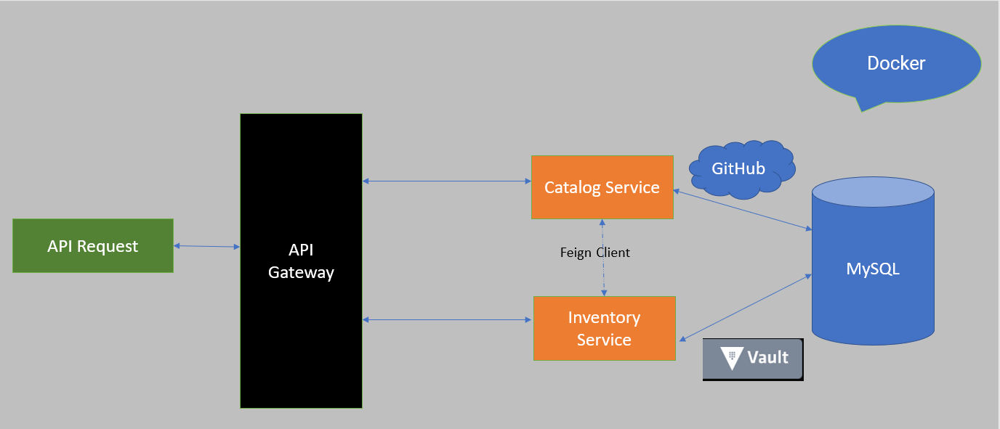

Code for [Shopping cart](https://github.com/ManjareK/ShoppingCart/tree/master)

Micro-Services architecture for Shopping cart. This repository deals with the micro-services based architecture for Shopping-cart websites.
The entire site is segregated as services based on the different business functionalities the website caters.

#Tech Stack
* Java 8
* Spring Boot
* MicroService Architecture
* Eureka Service discovery
* Spring Cloud config server
* Spring Cloud API Gateway
* Slueth
* Feign Client
* Resilience4j (Circuit Breaker)
* Docker
* JPA
* MySQL
* GitHub
* Vault

To use this repository follow the steps given below

Github Repositories
1. Clone the repositories to you local drive.
2. Start the individual services in this order
   1. Config Server - Modify the properties file location to your local git/git repository.
   2. Vault  - Create secrets and vault setup
   3. Service registry - Register the services to eureka
   4. gateway service
   5. mySql : Database startup and setup (Run data.sql files)
   6. catalog-service
   7. inventory-Service
## How to run?

### Build all modules:

`Shopping-cart> ./mvnw clean package -DskipTests=true`

### Start infrastructure modules in docker:

**The simplest way to run all the services in Docker:**

`Shopping-cart> ./run.sh start_all`

**To start only infrastructure services (mysqldb, config-server, service-registry, gateway-service) in docker:**

`Shopping-cart> ./run.sh start_infra`

**Start each microservice either in local or in docker:**

**Local:** `Shopping-cart/catalog-service> ./mvnw spring-boot:run`

**Docker:** `Shopping-cart> ./run.sh start <service>`

Ex: `Shopping-cart> ./run.sh start catalog-service`

* MySQL container:
     * hostname: mysqldb
     * Ports : 3306:3306 (<host_port>:<container_port>)
     * Username/Password: root/Root@123

* Vault:
    * hostname: vault
    * Ports: 8200:8200
    * Root token: spycjAioSYaD3YKZ37ipsvuRx

* config-server:
    * hostname: config-server
    * Ports: 8888:8888
    * URL: http://localhost:8888/
    * gitHub Url :https://github.com/ManjareK/microservices-config-repo

* service-registry:
    * hostname: service-registry
    * Ports: 8761:8761
    * URL: http://localhost:8761/
  
* gateway-service:
  * hostname: gateway-service
  * Ports: 9898:9898
  * URL: http://localhost:9898/

* catalog-service:
    * hostname: catalog-service
    * Ports: 8181:8181
    * URL: http://localhost:8181
    
* inventory-service   
    * hostname: inventory-service
    * Ports: 8484:8484
    * URL: http://localhost:8484

Sample Test

Individual API URL
1. http://localhost:8484/inventory/api/P001
2. http://localhost:8484/inventory
3. http://localhost:8181/catalog/products/P001
4. http://localhost:8181/catalog

API Gateway URL
1. http://localhost:9898/inventory/api/P001
2. http://localhost:9898/inventory
3. http://localhost:9898/catalog/products/P001
4. http://localhost:9898/catalog
